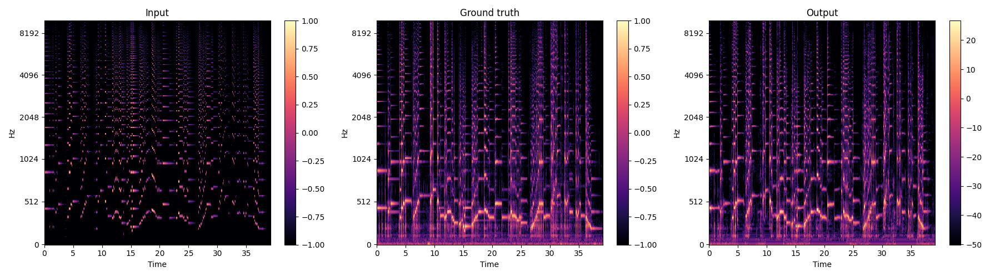

# Hum2Guitar
## Acoustic Guitar Timbre Transfer using Pix2PixHD architecture

> ## Examples: Ob la di ob la da - The Beatles
### [Check notebook and Listen examples here](https://nbviewer.org/gist/hwang9u/06cdd538d25bba76b72b3daae96ca1e3)

* Male version
<center>

</center>

* Female version
<center>

</center>


## ✨ Inspiration
I have ALWAYS loved playing the Guitar🎸 since I was young. (I especially enjoy fingerstyle playing.) When I first started practicing the guitar, my fingers didn't work. So I once dreamed that *"If I hum, I want it to change to guitar sound."* It was wildest dream at the time, so I just practiced the guitar harder. 😂 This project began simply with curiosity about the memory.

<br>

## Approach
#### ✅ Timbre-Transfer using Image-to-Image translation techniques
* I utilized the mel spectrogram as the imput images. It can show the time-frequency characteristics of sound.
* However, since it has only magnitude information. So I used Griffin-Lim algorithm as a baseline for phase reconstruction.
#### ✅ Semantic Harmonics as input semantic label
* I attempted to extract the fundamental frequency(F0) from audio signal and utilize the fact that *"its positive integer multiple is a harmonic"* to create a semantic label.
* I'll refer to the artificially generated harmonics as "Semantic Harmonics"
* **Therefore, we can create our own paired dataset. As you may have guessed, not only humming but any sound with pitch can be transformed into a guitar sound!**

#### ✅ Pix2PixHD Architecture
  * At first, I attempted to use the Pix2Pix architecture, but I found that it didn't represent local information well, resulting in lack of sharpness in the output audio sound.
  * Therefore, I tried to employ the Pix2PixHD architecture, which is known for capturing fine-grained details in local information. (Other SOTA architectures are also worth trying.)

#### ✅ Data Segmentation Instead of Data Augmentation
  * There are only 180 "solo" samples available in the GuitarSet dataset. It is extremely small size. I though more audio samples with various pitch are required.
  * Although the dataset size was very small, I didn't do any augmentation. **Because playing low notes on the guitar is not simply a matter of lowering the pitch. The resonance when plucking the strings also varies. When playing low notes, there is more "buzzing" sound, but "pitch shift" did not reflect this aspect.**
  * Instead, I segmented the audio files into 5s durations and stored them to enable more weight updates.

<br>


### Data Pre-Processing

<center>

</center>

### Training
<center>

</center>

### Reconstructing the Audio signal from Synthesized Mel Spectrogram
<center>

</center>


<br>

## Dataset
#### GuitarSet
  * only guitar "solo" (180 files)
  * link: https://github.com/marl/GuitarSet

#### MTG-QBH
  * This is used purely as evaluation examples and were never involved in the training process.
  * link: https://www.upf.edu/web/mtg/mtg-qbh

<br>

## Run
```python
$ cd hum2guitar
$ python source/train.py --guitar_dir GUITARSET_DIR --humming_dir HUMMING_DIR  
```
* Check ```utils/env.py``` and ```args.py``` for more training details.

<br>

## Results
### Loss Curve
#### - Global Generator
* Trained for 100 epochs
* Fixed learning rate
#### - Local Enhancer
* Trained only Local Enhancer for 10 epochs and then jointly trained for 200 epochs
* Jointly Trained for 200 epochs
Fixed learning rate for 100 epochs and linearly decayed afterwards.


### The Changes of outputs over epochs
* Guitar(top) and humming(bottom)
<center>
<figure class="half">


<figure>
</center>

### How close is the sound restored from the semantic harmonics of the guitar to the original, not humming semantic harmonics?
* **We can guess on how well the model can accurately restore from semantic harmonics based on these examples.**
* You can listen [here](#check-notebook-and-listen-examples-here)
<center>

</center>


## Outro
* What I obtained from this project was not an exact guitar playing sound but rather a sound resembling a guitar. My model produces a sound similar to when I first started playing the guitar , with a gentle plucking sensation as if using my fingers instead of a pick.
* Of course, using more advanced generation algorithms could potentially achieve a sound closer to that of a guitar. To address this aspect, I need to continue exploring various approaches and strive to improve and grow in the future.
* **But I think there's something about human's guitar playing that goes beyond a physical sound. It gives emotions beyond the mood given by elements such as the composition of the song and the type of instrument. No matter how AI develops in the future, I hope this will not change.**
<br>

#### +) To do: Key points I need to focus on
* The sound of a guitar is influenced by various factors.
  * The physical elements of the guitar itself: wood, strings, height of strings ...
  * The elements related to "playing": timbre when performing techniques such as sliding and hammering .... 
* It would be beneficial to first explore the characteristics in the frequency domain and also further investigate the impulse response of an acoustic guitar.
* Hyper-parameter optimization
* Attempts to approach using different generative model


### Reference
> [1] Ting-Chun Wang, Ming-Yu Liu, Jun-Yan Zhu, Andrew Tao, Jan Kautz, and Bryan Catanzaro. "High-Resolution Image Synthesis and Semantic Manipulation with Conditional GANs", in CVPR, 2018.  
> [2] Pix2PixHD official repository: https://github.com/NVIDIA/pix2pixHD/tree/master  
> [3] PyCeps: https://github.com/hwang9u/pyceps


### Cite

If you want to use this code, please cite as follows:
```
@misc{hwang9u-hum2guitar,
  author = {Kim Seonjoo},
  title = {hum2guitar},
  year = {2023},
  publisher = {GitHub},
  journal = {GitHub repository},
  howpublished = {\url{https://github.com/hwang9u/hum2guitar}},
}
```

